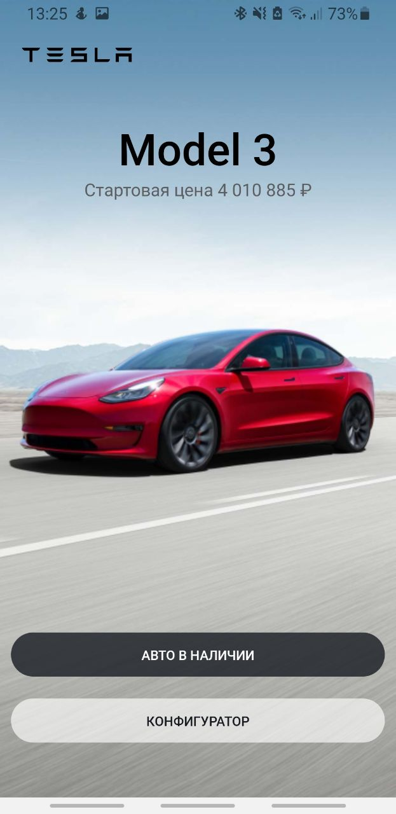
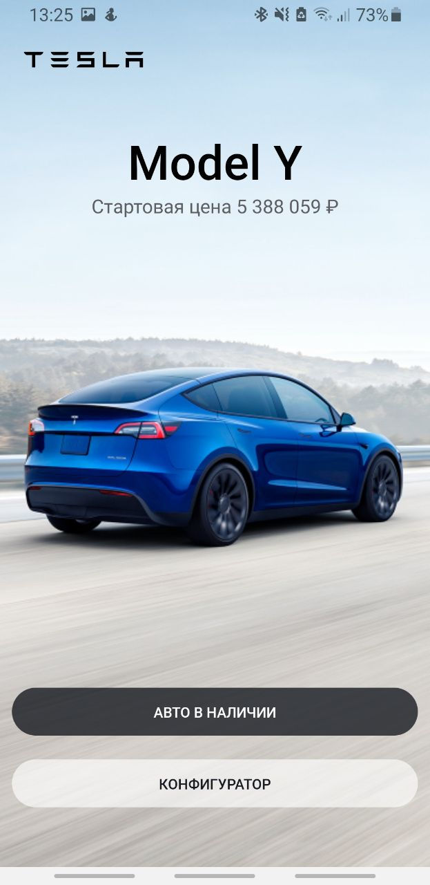

# TeslaClone-app

   
   
   
   

## Stack:
- expo
- react-native
- js

## To create build:
- ios:
   `expo build:ios`
- android:
   `expo build:android`
  
## To start the expo-app:
  `yarn start`
